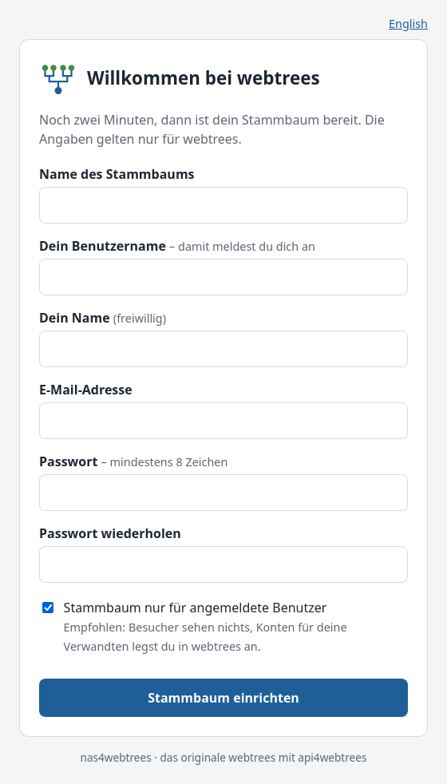

<p align="center"></p>

# nas4webtrees

[English](README.md) · **Deutsch**

**Dein Stammbaum auf deiner eigenen NAS – das originale [webtrees](https://webtrees.net/), in wenigen Minuten
bereit, mit einem klassischen Programm für Windows und Linux und einer App für Android.**

<p align="center">
  <a href="https://github.com/thobgg/nas4webtrees/releases/latest"></a>
  <a href="https://github.com/thobgg/nas4webtrees/pkgs/container/nas4webtrees"></a>
  
  <a href="LICENSE"></a>
</p>

- **In Minuten installiert, ohne IT-Kenntnisse.** Auf der Synology ein Paket mit Installationsassistent, überall
  sonst das Image starten und eine kurze Seite im Browser ausfüllen. Kein Datenbank-Server, kein Webserver, kein PHP.
- **Das originale webtrees, kein Fork.** Die offizielle Release-Datei, mit Prüfsumme. webtrees aktualisiert sich wie
  gewohnt unter *Verwaltung → Aktualisierung*; ein neues Image fasst es nie an und setzt es nie zurück.
- **Arbeiten wie in einem klassischen Genealogie-Programm.** [wtWin](https://github.com/thobgg/app4webtrees) (Windows)
  und wtTux (Linux) verbinden sich auf der Seite „App“ mit einem Klick – keine Adresse, kein Passwort eintippen. Am
  Handy verbindet sich [wtAnd](https://github.com/thobgg/app4webtrees) per QR-Code.
  [api4webtrees](https://github.com/thobgg/api4webtrees) ist vorinstalliert.
- **Von Anfang an privat.** Ein neuer Stammbaum ist nur für angemeldete Benutzer sichtbar; die Konten für deine
  Verwandten legst du an.
- **Deine GEDCOM-Datei, jede Nacht.** Jeder Stammbaum als `backup/gedcom/<baum>.ged` (dazu 30 ältere Stände), eine
  konsistente Kopie der Datenbank und alle Fotos. Neu installieren neben der Sicherung holt alles zurück.
- **Updates aus dem Paket-Zentrum.** Synology-Nutzer tragen die Paketquelle einmal ein; neue Versionen erscheinen von selbst.

| Einrichtung im Browser | Ein Klick zum Programm am PC | wtWin unter Windows |
| :-: | :-: | :-: |
|  |  |  |

| Synology: Installationsassistent | Synology: Paket-Zentrum | Synology: Hauptmenü |
| :-: | :-: | :-: |
|  |  |  |

## Wo es läuft

| Plattform | Weg | Anleitung | Getestet |
| - | - | - | - |
| **Synology** (DSM 7.2+, Modelle mit Container Manager) | Paket mit Installationsassistent, Updates über die [Paketquelle](https://thobgg.github.io/nas4webtrees/) | [mit Screenshots](docs/synology/anleitung.de.md) | ✅ DS225+ (DSM 7.4.1), Virtual DSM |
| **Linux-Server, Raspberry Pi** | `docker compose up -d`, dann die Einrichtungsseite | unten | ✅ amd64 · Images für arm64/armv7 gebaut, noch kein Bericht |
| **QNAP** (Container Station 3) | Applications → Create, Compose-Datei einfügen | [Anleitung](docs/qnap/anleitung.de.md) | ⬜ noch nicht |
| **UGREEN** (UGOS Pro) | Docker → Project → Create, Compose-Datei einfügen | [Anleitung](docs/ugreen/anleitung.de.md) | ⬜ noch nicht |
| **TrueNAS** ab 25.04 | Apps → Discover → *Install via YAML* | [Anleitung](docs/truenas/anleitung.de.md) | ⬜ noch nicht |
| **CasaOS / ZimaOS** | Compose-Datei einfügen; Aufnahme in den BigBear-App-Store beantragt | – | 🟡 Compose-Datei getestet, nicht auf dem Gerät |
| **Umbrel** | App Store → Community App Stores → `https://github.com/thobgg/nas4webtrees-umbrel` | [Store](https://github.com/thobgg/nas4webtrees-umbrel) | ⬜ noch nicht |
| **Unraid** | Vorlage [`unraid/nas4webtrees.xml`](unraid/nas4webtrees.xml) | – | ⬜ noch nicht |
| **TerraMaster** (TOS 6) | Docker Manager → Project, Compose-Datei einfügen | – | ⬜ noch nicht |
| **Asustor** (ADM) | Portainer aus App Central → Stacks, Compose-Datei einfügen | – | ⬜ noch nicht |
| **Windows- oder Mac-PC ohne NAS** | noch nicht – geplant: ein eigener Stammbaum direkt in wtWin | – | – |

✅ auf dem Gerät getestet · 🟡 teilweise · ⬜ sollte laufen (dasselbe Image), auf dem Gerät noch nicht getestet.
**Auf einem dieser Geräte installiert?** Erzähl uns, wie es lief – ein kurzer
[Installationsbericht](https://github.com/thobgg/nas4webtrees/issues/new?template=installation-report.yml) hilft allen, die nach dir kommen.

## Schnellstart (Docker Compose)

```sh
mkdir webtrees && cd webtrees
curl -O https://raw.githubusercontent.com/thobgg/nas4webtrees/main/compose/docker-compose.yml
docker compose up -d
```

`http://<deine-nas>:8095` öffnen und die kurze Einrichtungsseite ausfüllen: Name des Stammbaums, dein Konto, privat
ja oder nein. Keine Datenbankfrage, kein Passwort in einer Datei. Kommt der Aufruf nicht aus dem Heimnetz, fragt die
Seite nach einem Einrichtungscode aus dem Container-Protokoll (`docker logs webtrees`). Einrichtung ohne Browser
(Automatisierung): `WT_USER`, `WT_EMAIL` und `WT_PASS_FILE` setzen, siehe [Settings](README.md#settings).

## Synology in Kürze

📖 **[Schritt-für-Schritt-Anleitung mit Screenshots](docs/synology/anleitung.de.md)**

1. **Container Manager** aus dem Paket-Zentrum installieren (einmalig).
2. Paket-Zentrum → *Einstellungen* → *Paketquellen* → *Hinzufügen*: `https://thobgg.github.io/nas4webtrees/index.json`
   – oder `nas4webtrees-….spk` von den [Releases](https://github.com/thobgg/nas4webtrees/releases) laden und über
   *Manuelle Installation* einspielen.
3. nas4webtrees installieren, den Drittanbieter-Hinweis bestätigen, den Assistenten ausfüllen (Stammbaum,
   Administrator, Port, Ordner für die Sicherung).
4. webtrees im DSM-Hauptmenü öffnen (*nas4webtrees*); *nas4webtrees – Apps verbinden* führt zur Seite für die Apps.

## Apps verbinden

In webtrees anmelden und die Seite **App** öffnen. Am PC: wtWin (oder wtTux) herunterladen, installieren, starten
und **Mit wtWin verbinden** klicken – das Programm übernimmt Adresse und Anmeldung und fragt einmal nach. Am Handy:
wtAnd installieren und den QR-Code scannen. Für Mac, iPhone und iPad gibt es noch keine App – dort webtrees im
Browser nutzen. Mehr: [api4webtrees](https://github.com/thobgg/api4webtrees/blob/main/README.de.md).

## Zugriff von unterwegs

Den Reverse Proxy der NAS davorschalten (Synology: *Systemsteuerung → Anmeldeportal → Erweitert → Reverse Proxy*),
außen HTTPS, innen `http://localhost:8095`. Das Image beachtet `X-Forwarded-Proto`, webtrees erzeugt dann
`https://`-Links. Zu Hause verbinden sich die Apps auch über `http://`.

## Kein offizielles webtrees-Projekt

nas4webtrees ist ein unabhängiges Gemeinschaftsprojekt, das webtrees für NAS verpackt. Es steht in keiner
Verbindung zum webtrees-Projekt und wird von ihm nicht unterstützt. Zu webtrees selbst:
[webtrees.net](https://webtrees.net/). Fragen und Fehler: [Issues](https://github.com/thobgg/nas4webtrees/issues).

## Lizenz

GPL-3.0-or-later, wie webtrees und api4webtrees. webtrees ist © das webtrees-Entwicklerteam; dieses Projekt
verpackt es nur.
