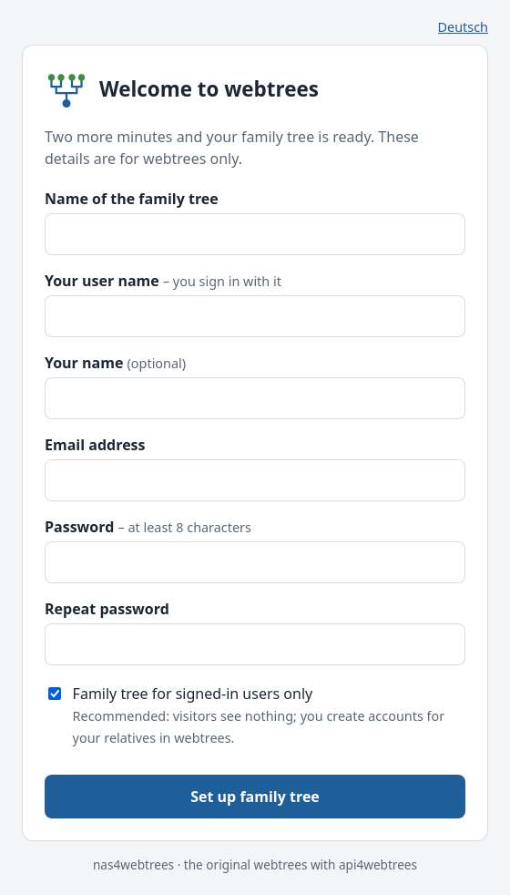
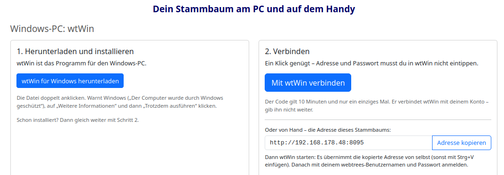
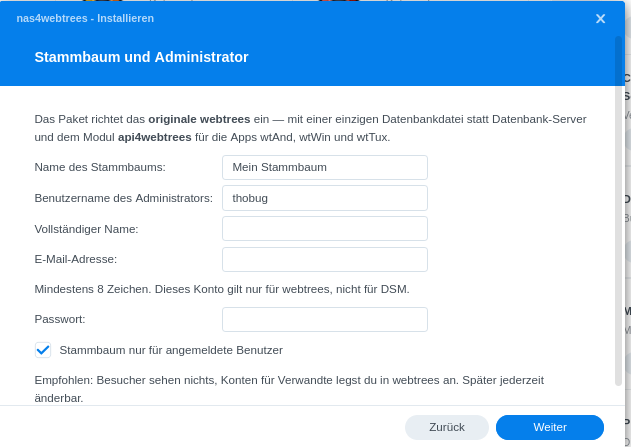
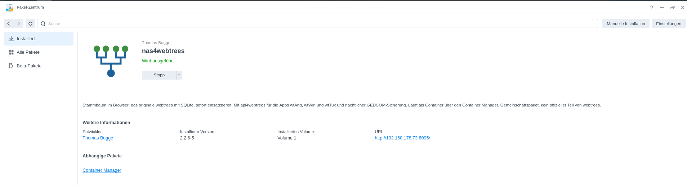
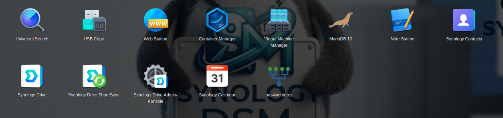

<p align="center"></p>

# nas4webtrees

**English** · [Deutsch](README.de.md)

**Your family tree on your own NAS – the original [webtrees](https://webtrees.net/), ready in a few minutes,
with a classic desktop program for Windows and Linux and an app for Android.**

<p align="center">
  <a href="https://github.com/thobgg/nas4webtrees/releases/latest"></a>
  <a href="https://github.com/thobgg/nas4webtrees/pkgs/container/nas4webtrees"></a>
  
  <a href="LICENSE"></a>
</p>

- **Installed in minutes, no IT knowledge needed.** On Synology a package with an installation wizard; everywhere
  else start the image and fill in one short page in the browser. No database server, no web server, no PHP setup.
- **The original webtrees, not a fork.** The official release, checksum-verified. webtrees updates itself as usual
  under *Control panel → Upgrade*; a new image never touches or downgrades it.
- **Work like in a classic genealogy program.** [wtWin](https://github.com/thobgg/app4webtrees) (Windows) and wtTux
  (Linux) connect with one click on the page “App” – no address, no password to type. On the phone,
  [wtAnd](https://github.com/thobgg/app4webtrees) connects via QR code. [api4webtrees](https://github.com/thobgg/api4webtrees)
  is preinstalled.
- **Private by default.** A new family tree is visible to signed-in users only; you create the accounts for your relatives.
- **Your GEDCOM file, every night.** Each family tree as `backup/gedcom/<tree>.ged` (plus 30 older states), a
  consistent copy of the database and all photos. Reinstall next to the backup and everything comes back.
- **Updates from the Package Center.** Synology users add the package source once; new versions appear by themselves.

| Setup in the browser | One click to the desktop program | wtWin on Windows |
| :-: | :-: | :-: |
|  |  |  |

| Synology: installation wizard | Synology: Package Center | Synology: main menu |
| :-: | :-: | :-: |
|  |  |  |

## Where it runs

| Platform | How | Guide | Tested |
| - | - | - | - |
| **Synology** (DSM 7.2+, models with Container Manager) | Package with installation wizard, updates via the [package source](https://thobgg.github.io/nas4webtrees/) | [German, with screenshots](docs/synology/anleitung.de.md) | ✅ DS225+ (DSM 7.4.1), Virtual DSM |
| **Linux server, Raspberry Pi** | `docker compose up -d`, then the setup page | below | ✅ amd64 · arm64/armv7 images built, not yet reported |
| **QNAP** (Container Station 3) | Applications → Create, paste the compose file | [German](docs/qnap/anleitung.de.md) | ⬜ not yet |
| **UGREEN** (UGOS Pro) | Docker → Project → Create, paste the compose file | [German](docs/ugreen/anleitung.de.md) | ⬜ not yet |
| **TrueNAS** 25.04+ | Apps → Discover → *Install via YAML* | [German](docs/truenas/anleitung.de.md) | ⬜ not yet |
| **CasaOS / ZimaOS** | Paste the compose file; BigBear App Store requested | – | 🟡 compose file tested, not on the device |
| **Umbrel** | App Store → Community App Stores → `https://github.com/thobgg/nas4webtrees-umbrel` | [store](https://github.com/thobgg/nas4webtrees-umbrel) | ⬜ not yet |
| **Unraid** | Template [`unraid/nas4webtrees.xml`](unraid/nas4webtrees.xml) | – | ⬜ not yet |
| **TerraMaster** (TOS 6) | Docker Manager → Project, paste the compose file | – | ⬜ not yet |
| **Asustor** (ADM) | Portainer from App Central → Stacks, paste the compose file | – | ⬜ not yet |
| **Windows or Mac PC without a NAS** | not yet – planned: a local family tree inside wtWin | – | – |

✅ tested on the device · 🟡 partly · ⬜ should work (same image), not yet tested on the device.
**Installed it on one of these?** Please tell us how it went – a short [installation report](https://github.com/thobgg/nas4webtrees/issues/new?template=installation-report.yml) helps
everyone who comes after you.

## Quick start (Docker Compose)

```sh
mkdir webtrees && cd webtrees
curl -O https://raw.githubusercontent.com/thobgg/nas4webtrees/main/compose/docker-compose.yml
docker compose up -d
```

Open `http://<your-nas>:8095` and fill in the short setup page: name of the family tree, your account, private yes
or no. No database questions, no password in any file. If the page is not opened from your home network, it asks
for a setup code shown in the container log (`docker logs webtrees`). Setup without a browser (automation): set
`WT_USER`, `WT_EMAIL` and `WT_PASS_FILE`, see below.

## Synology in short

1. Install **Container Manager** from Package Center (once).
2. Package Center → *Settings* → *Package Sources* → *Add*: `https://thobgg.github.io/nas4webtrees/index.json`
   – or download `nas4webtrees-….spk` from [Releases](https://github.com/thobgg/nas4webtrees/releases) and use *Manual Install*.
3. Install nas4webtrees, confirm the third-party notice, fill in the wizard (family tree, administrator, port, backup folder).
4. Open webtrees from the DSM main menu (*nas4webtrees*); *nas4webtrees – Apps verbinden* leads to the page for the apps.

## Connecting the apps

Sign in to webtrees and open the page **App**. At the PC: download and install wtWin (or wtTux), start it and click
**Connect with wtWin** – the program takes over address and sign-in and asks once. On the phone: install wtAnd and
scan the QR code. Mac, iPhone and iPad have no app yet – use webtrees in the browser. Details:
[api4webtrees](https://github.com/thobgg/api4webtrees#readme).

## Settings

| Variable | Default | Meaning |
| - | - | - |
| `WT_USER`, `WT_NAME`, `WT_EMAIL` | – | Administrator created on first start (instead of the setup page) |
| `WT_PASS` / `WT_PASS_FILE` | – | Their password (prefer the file variant: Docker secret) |
| `WT_LANG` | `en-US` (setup page: browser language) | Language for setup and visitors (`de`, `nl`, `fr`, …) |
| `WT_TREE`, `WT_TREE_TITLE` | `tree1`, `My family tree` | First family tree |
| `WT_RESTORE` | `true` | Restore from `/backup` on a fresh install |
| `WT_PRIVATE` | `true` | New family tree only for signed-in users, no self-registration (the administrator creates accounts). `false` keeps the webtrees default: public tree, living people hidden |
| `TZ` | – | Time zone, e.g. `Europe/Berlin` |
| `PUID`, `PGID` | 33 | Owner of the files (Unraid: 99/100) |
| `WRITE_GID` | – | Group that may write on ACL-managed shares; used only if the files are not writable otherwise |
| `BASE_URL`, `PRETTY_URLS` | – | Only if you need them; set on every start |
| `BACKUP_HOUR` | `3` | Hour of the nightly backup |
| `BACKUP_KEEP_GEDCOM`, `BACKUP_KEEP_DB` | `30`, `7` | States kept |
| `DB_TYPE`, `DB_HOST`, `DB_PORT`, `DB_USER`, `DB_PASS(_FILE)`, `DB_NAME`, `DB_PREFIX` | `sqlite`, …, `webtrees`, `wt_` | Other databases |
| `PHP_MEMORY_LIMIT`, `PHP_MAX_EXECUTION_TIME`, `PHP_UPLOAD_MAX_FILE_SIZE`, `PHP_POST_MAX_SIZE` | `1024M`, `90`, `64M`, `64M` | PHP limits |

Volumes: `/webtrees` (program and data), `/backup` (backup and import folder).

## Access from outside

Put the reverse proxy of your NAS in front (Synology: *Control Panel → Login Portal → Advanced → Reverse Proxy*),
HTTPS outside, `http://localhost:8095` inside. The image honours `X-Forwarded-Proto`, so webtrees produces
`https://` links. At home the apps connect over plain `http://` too.

## Not an official webtrees project

nas4webtrees is an independent community project that packages webtrees for NAS devices. It is not affiliated
with or endorsed by the webtrees project. For webtrees itself, see [webtrees.net](https://webtrees.net/).
Questions and bugs: [issues](https://github.com/thobgg/nas4webtrees/issues).

## License

GPL-3.0-or-later, like webtrees and api4webtrees. webtrees is © the webtrees development team; this project only
packages it.
