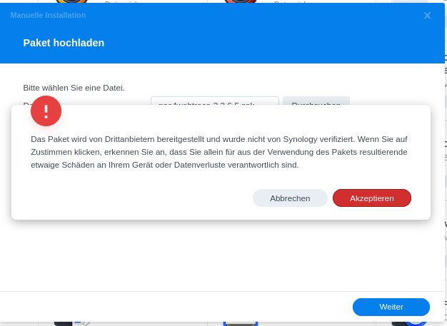
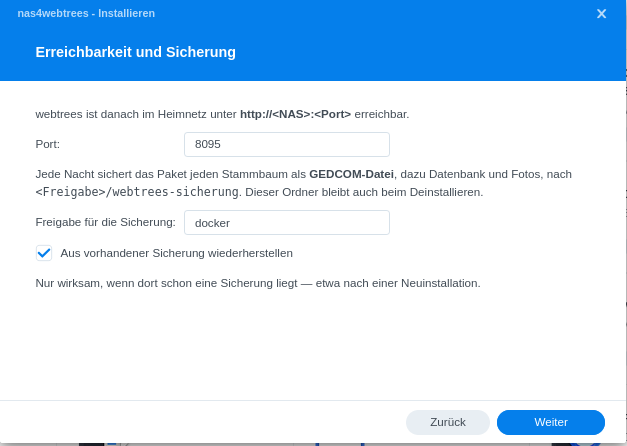
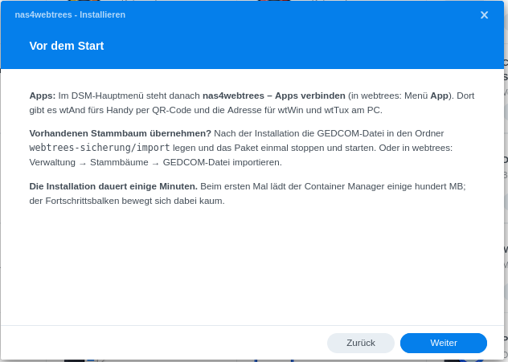
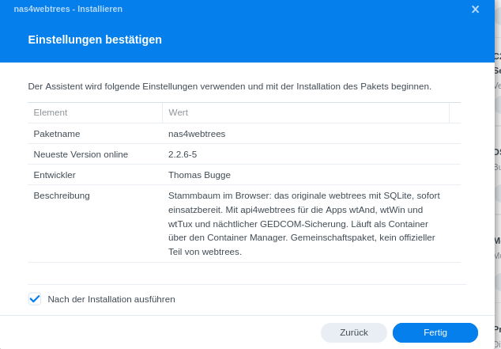

# nas4webtrees auf der Synology – Schritt für Schritt

Diese Anleitung führt dich ohne Vorkenntnisse zu einem eigenen webtrees-Stammbaum auf deiner
Synology. Du brauchst weder Web Station noch einen Datenbank-Server. Rechne mit einer
Viertelstunde.

nas4webtrees ist ein Gemeinschaftspaket und kein offizieller Teil von webtrees.

## 1. Voraussetzungen

- Eine Synology mit **DSM 7.2 oder neuer**, auf der es den **Container Manager** gibt. Das sind alle
  Plus-Modelle und viele neuere Einsteigergeräte. Ob dein Modell dabei ist, zeigt die
  [Liste von Synology](https://www.synology.com/de-de/dsm/packages/ContainerManager).
- Internet während der Installation (das Paket lädt einige hundert MB).

**Container Manager installieren** (einmalig): *Paket-Zentrum → Alle Pakete → „Container Manager“ →
Installieren.* Das Paket-Zentrum installiert ihn nicht von selbst mit.

## 2. Paket herunterladen

Auf der Seite [Releases](https://github.com/thobgg/nas4webtrees/releases/latest) die Datei
`nas4webtrees-….spk` herunterladen, zum Beispiel `nas4webtrees-2.2.6-6.spk`.

Alternative ohne Download: die Paketquelle eintragen (siehe Abschnitt 9) und nas4webtrees im
Paket-Zentrum unter *Community* installieren. Dann meldet das Paket-Zentrum auch alle Updates.

## 3. Installieren

*Paket-Zentrum → oben rechts „Manuelle Installation“ → Durchsuchen → die .spk-Datei wählen → Weiter.*

Synology weist darauf hin, dass das Paket nicht von Synology stammt. Mit **Akzeptieren** geht es
weiter.

**Seite 1 – Stammbaum und Administrator.** Gib deinem Stammbaum einen Namen und lege dein
webtrees-Konto an. Das Konto gilt nur für webtrees, nicht für die Anmeldung an der Synology.
Den Haken **„Stammbaum nur für angemeldete Benutzer“** lässt du für einen Familien-Stammbaum drin:
Besucher sehen dann nichts, und die Konten für deine Verwandten legst du selbst an.

**Seite 2 – Erreichbarkeit und Sicherung.** Beides kannst du so lassen. Der **Port** (8095) gehört
zur Adresse, unter der webtrees später erreichbar ist. Unter **Freigabe für die Sicherung** legt das
Paket jede Nacht eine Sicherung ab (siehe Abschnitt 8).

**Seite 3 – Vor dem Start.** Nur Hinweise. Weiter.

**Bestätigen.** Den Haken „Nach der Installation ausführen“ drin lassen und **Fertig** klicken.

Die Installation dauert einige Minuten. Danach steht im Paket-Zentrum **„Wird ausgeführt“**.

## 4. Öffnen und anmelden

webtrees öffnest du auf einem dieser Wege:

- im **Hauptmenü** der Synology (oben links) über **nas4webtrees**,
- im Paket-Zentrum über **Öffnen** oder den Link unter „URL“,
- direkt im Browser unter `http://<Adresse deiner Synology>:8095`.

Melde dich mit dem Konto aus Seite 1 an.

Im neuen Stammbaum steht eine Beispielperson „John DOE“. Die legt webtrees selbst an; sie
verschwindet, sobald du deinen Stammbaum importierst (Abschnitt 5), oder du löschst sie.

## 5. Den eigenen Stammbaum übernehmen

Wer schon mit einem Programm wie Ahnenblatt, Gramps, Legacy oder MyHeritage arbeitet: dort eine
**GEDCOM-Datei** exportieren (Endung `.ged`). Dann auf einem der beiden Wege:

- **In webtrees:** *Verwaltung → Stammbäume → „GEDCOM-Datei importieren“* und die Datei hochladen.
- **Über die File Station:** die Datei in den Ordner `docker/webtrees-sicherung/import` legen, dann im
  Paket-Zentrum nas4webtrees **stoppen und wieder starten**. Das Paket übernimmt die Datei in den
  noch leeren Stammbaum und legt sie danach unter `import/done` ab.

## 6. Die Familie einladen

- **Konten anlegen:** *Verwaltung → Benutzer → Benutzer hinzufügen.* Rolle **Mitglied** darf lesen,
  **Bearbeiter** darf ändern. Benutzername und Passwort gibst du deinen Verwandten weiter.
- **Sich selbst im Stammbaum finden:** Bei jedem Konto unter „Stammbaum“ die eigene Person
  verknüpfen. Erst dann zeigen webtrees und die Apps Verwandtschaften wie „Großvater
  väterlicherseits“.

## 7. Die Apps verbinden

Im Hauptmenü der Synology führt **nas4webtrees – Apps verbinden** direkt zur Seite „App“ in
webtrees (nach dem Anmelden auch über den blauen Hinweis oben). Adresse und Passwort musst du in den
Apps nicht eintippen:

- **Windows-PC (wtWin):**
  1. **wtWin für Windows herunterladen**, die Datei doppelt anklicken und installieren. Warnt Windows
     („Der Computer wurde durch Windows geschützt“): **Weitere Informationen** → **Trotzdem ausführen**.
  2. wtWin starten, zurück in den Browser und auf **Mit wtWin verbinden** klicken.
  3. wtWin fragt einmal „Mit diesem Server verbinden?“ → **Verbinden**. Fertig, dein Stammbaum ist offen.
- **Android-Handy (wtAnd):** App herunterladen, dann den QR-Code unter „Mit deinem Konto verbinden“
  mit der Handy-Kamera scannen (oder die Seite am Handy öffnen und auf **Jetzt verbinden** tippen).
- **Linux-PC (wtTux):** unter „Auch für Linux“, genauso wie bei Windows.

Dafür braucht es wtWin/wtTux ab 1.21 und wtAnd ab 1.19. Im Heimnetz verbinden sich die Apps auch
ohne Verschlüsselung; von unterwegs geht das erst mit Abschnitt 10.

## 8. Deine Sicherung

Jede Nacht um 3 Uhr legt das Paket in `docker/webtrees-sicherung` ab:

| Ordner | Inhalt |
| - | - |
| `gedcom/<baum>.ged` | Der aktuelle Stand jedes Stammbaums als GEDCOM-Datei, die jedes Genealogie-Programm öffnen kann. Dazu die älteren Stände der letzten 30 Nächte. |
| `database/` | Eine vollständige Kopie der webtrees-Datenbank mit allen Konten und Einstellungen |
| `media/` | Alle Fotos und Dokumente aus webtrees |

Dieser Ordner bleibt auch stehen, wenn du das Paket deinstallierst. Installierst du es später neu
(mit „Aus vorhandener Sicherung wiederherstellen“), übernimmt es den letzten Stand samt Konten.

Tipp: Nimm den Ordner in deine übliche Datensicherung auf, zum Beispiel Hyper Backup.

## 9. Updates

- **webtrees selbst** aktualisierst du wie gewohnt in webtrees unter *Verwaltung → Aktualisierung*,
  sobald webtrees eine neue Fassung meldet.
- **Das Paket** (Umgebung und api4webtrees): Am bequemsten trägst du einmal die Paketquelle ein,
  dann meldet das Paket-Zentrum neue Versionen von selbst:
  *Paket-Zentrum → Einstellungen → Paketquellen → Hinzufügen*, Name `nas4webtrees`, Ort
  `https://thobgg.github.io/nas4webtrees/index.json`. Updates erscheinen danach unter
  *Installiert*, das Paket selbst auch unter *Community*. Zum Aktualisieren auf den **Namen
  „nas4webtrees“** klicken und auf der Detailseite **Aktualisierung** wählen – der grüne Knopf direkt in
  der Liste öffnet unter DSM 7.4 stattdessen webtrees. Bequemer: unter *Einstellungen → Automatisch
  aktualisieren* nas4webtrees auswählen, dann läuft jedes Update von selbst.
  Ohne Paketquelle: neue .spk-Datei von der Release-Seite laden und über *Manuelle Installation*
  einspielen.

  In beiden Fällen bleiben Stammbaum, Konten und Fotos erhalten, und webtrees wird dabei nie auf
  eine ältere Fassung zurückgesetzt.

## 10. Von unterwegs erreichbar machen (für Fortgeschrittene)

Für den Zugriff aus dem Internet braucht es eine verschlüsselte Adresse (https) über den Reverse
Proxy der Synology:

1. Eine Adresse für deine Synology, zum Beispiel über *Systemsteuerung → Externer Zugriff → DDNS*,
   und ein Zertifikat dafür unter *Systemsteuerung → Sicherheit → Zertifikat* (Let's Encrypt).
2. *Systemsteuerung → Anmeldeportal → Erweitert → Reverse Proxy → Erstellen:*
   Quelle **HTTPS**, deine Adresse, Port **443** — Ziel **HTTP**, `localhost`, Port **8095**.
3. Im Router Port 443 zur Synology weiterleiten.

Danach verbinden sich die Apps auch von unterwegs über `https://<deine Adresse>`.

## 11. Deinstallieren

*Paket-Zentrum → nas4webtrees → Deinstallieren.* Entfernt werden das Programm und die Datenbank
unter `docker/nas4webtrees`. Deine Sicherung in `docker/webtrees-sicherung` bleibt stehen.

## 12. Wenn etwas nicht klappt

- **„Port ist schon belegt“:** Auf Seite 2 einen anderen Port wählen, zum Beispiel 8096.
- **„Container Manager“ fehlt:** Zuerst Abschnitt 1.
- **Protokoll:** *Container Manager → Container → syno-nas4webtrees → Details → Protokoll.* Die Zeilen
  mit `[nas4webtrees]` beschreiben jeden Schritt.
- **Fragen und Fehler:** [Issues auf GitHub](https://github.com/thobgg/nas4webtrees/issues)
